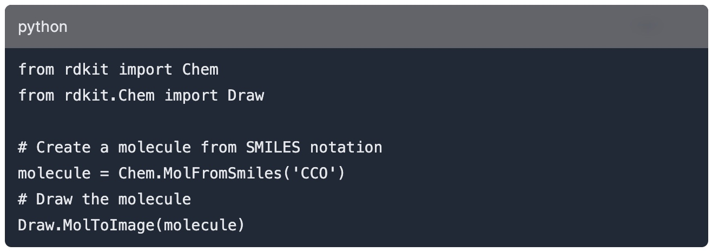
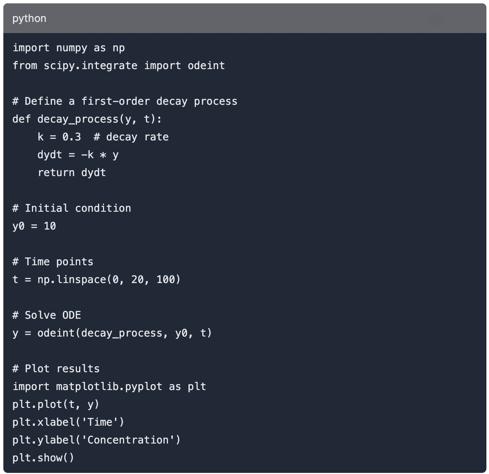
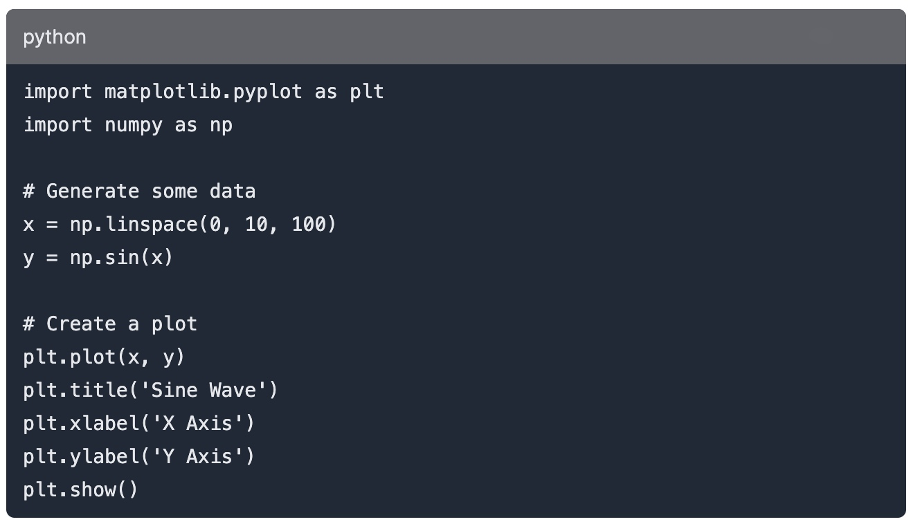

# Blog 3: Unleashing the Power of Python in Chemistry: A Guide to the Best Tools and Libraries

In the realm of scientific discovery, the fusion of technology and chemistry has opened up new frontiers. Among the plethora of programming languages available, Python has emerged as a beacon for chemists and researchers. Its simplicity, flexibility, and vast array of libraries make it an indispensable tool in the modern chemist's toolkit. This blog post dives into the world of Python for chemistry, exploring the most powerful tools and libraries that have revolutionized how we approach chemical data and computation. Whether you're a seasoned researcher or a chemistry enthusiast, this guide will illuminate the path to harnessing the power of Python in your chemical explorations.

## Python and Chemistry: A Match Made in the Lab

Python's rise to prominence in the scientific community is no accident. It's easy-to-learn syntax and comprehensive standard libraries allow scientists to perform complex calculations and data analysis with minimal code. But what makes Python particularly appealing for chemistry is its vibrant ecosystem of specialized libraries. These tools can handle everything from molecular simulation to quantum chemistry, making Python an all-encompassing language for chemical research.

## Essential Python Libraries for Chemists

Exploring the landscape of Python libraries reveals a treasure trove of resources for chemists. Here, we highlight some of the most acclaimed libraries that have become integral to chemical research and education.

### RDKit: Navigating Molecular Spaces

RDKit is an open-source toolkit for cheminformatics. It enables chemists to manipulate chemical structures, perform substructure searches, generate 3D models, and predict molecular properties. RDKit's extensive functionality makes it a cornerstone for drug discovery and pharmaceutical research.

### SciPy and NumPy: The Backbone of Scientific Computing

No discussion about Python in science would be complete without mentioning SciPy and NumPy. These libraries provide powerful mathematical functions and operations for handling arrays and matrices, which are fundamental in computational chemistry for tasks like solving differential equations or performing statistical analysis.

### Matplotlib: Visualizing Chemical Data

Visualization is a key aspect of chemistry, whether it's plotting experimental data or illustrating complex molecular structures. Matplotlib is Python's most well-known library for creating static, animated, and interactive visualizations. Its versatility and ease of use make it an essential tool for chemists.

## Key Resources and Libraries

- **RDKit**: A comprehensive cheminformatics library that allows for the manipulation of chemical information in Python. For more details and documentation, visit the [RDKit official website](https://www.rdkit.org).

- **SciPy and NumPy**: Core libraries for scientific computing in Python, offering robust mathematical functions for handling arrays, matrices, and more. Learn more about SciPy at its [official website](https://www.scipy.org) and about NumPy at [numpy.org](https://numpy.org).

- **Matplotlib**: The go-to library for creating static, animated, and interactive visualizations in Python. For tutorials, documentation, and examples, visit [Matplotlib's official site](https://matplotlib.org).

## Additional References

- **Python.org**: The home of Python, where you can download the Python interpreter, find extensive documentation, and explore the vast Python ecosystem. Visit [Python's official website](https://www.python.org) for more information.

- **GitHub - Awesome Python Chemistry**: A curated list of Python resources and libraries specifically for chemistry, which served as inspiration for this blog post. Check out the list on [GitHub](https://github.com/Immentel/awesome-python-chemistry).

- **Chemistry Stack Exchange**: A question and answer site for scientists, academics, teachers, and students in the field of chemistry. A great resource for getting answers to specific chemistry-related queries. Visit the [Chemistry Stack Exchange](https://chemistry.stackexchange.com).

## Additional Resources and Educational Opportunities

For those looking to deepen their understanding of using Python in scientific and chemical research, several educational resources are available:

- [Coursera](https://www.coursera.org) and [edX](https://www.edx.org): Both platforms offer courses on Python for scientific computing, data analysis, and more, taught by experts from universities and institutions around the world.

For more information and to get answers to specific chemistry-related queries, visit the [Chemistry Stack Exchange](https://chemistry.stackexchange.com).

Incorporating these resources into your exploration of Python in chemistry will not only enhance your understanding but also equip you with the tools to innovate and make new discoveries in your research.

Erin Wasserman is a Data Science student at the Flatiron School. She has 20 years of experience in high school teaching and research.   

