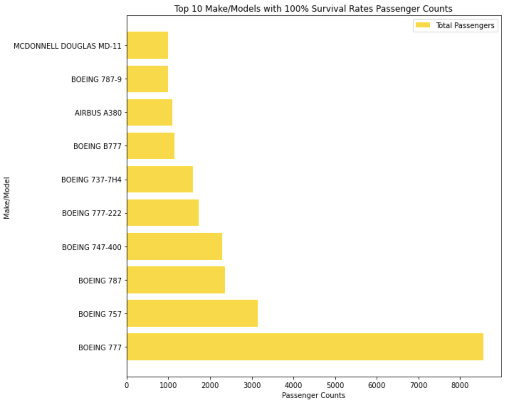
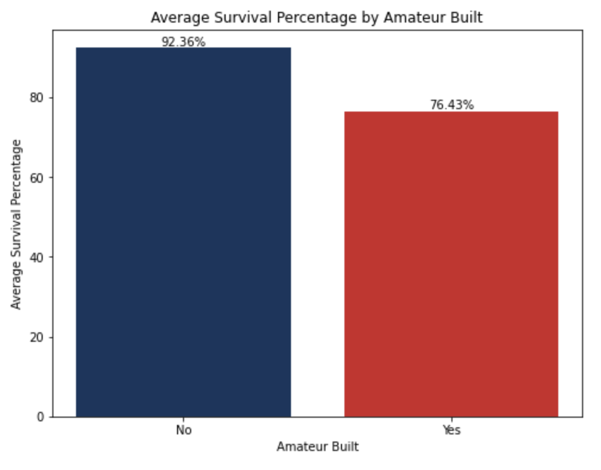
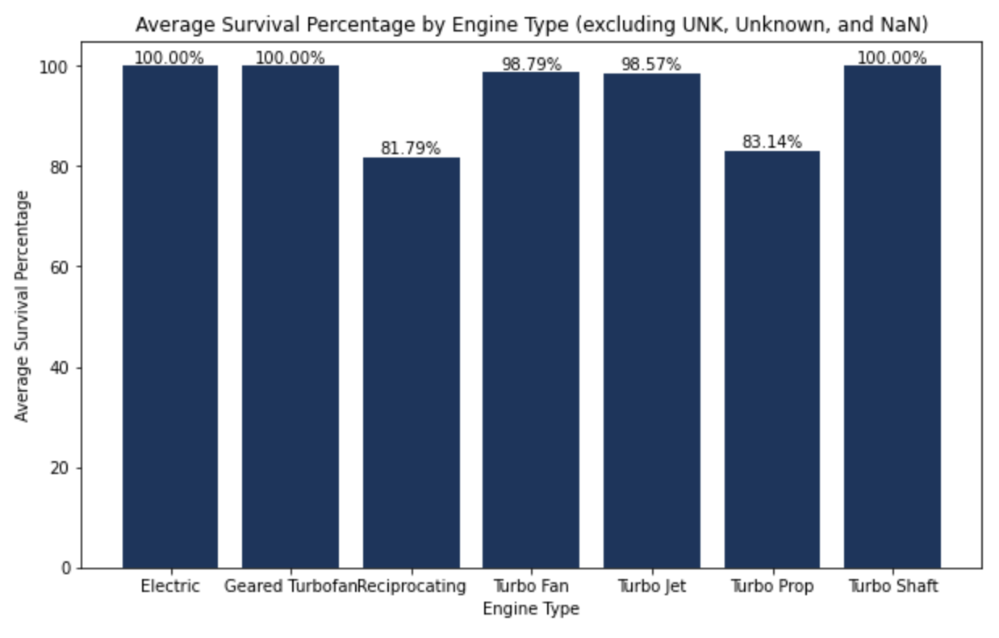
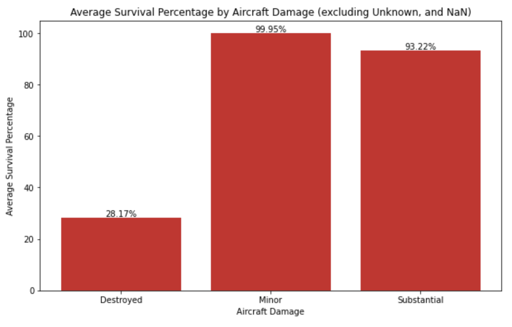
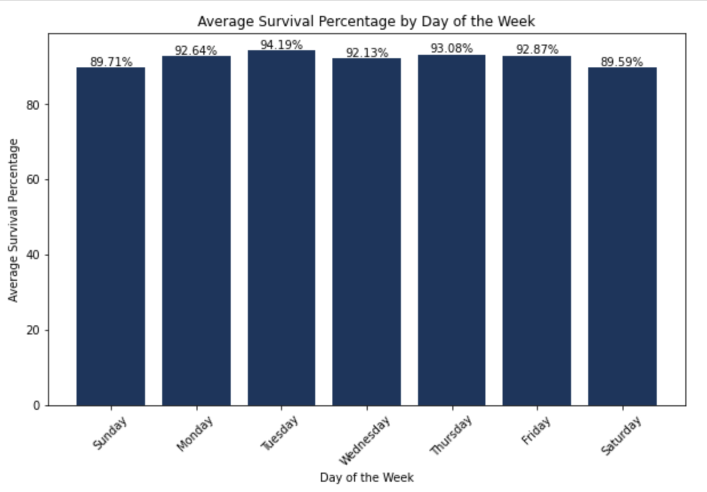

# Safest Aircraft Analysis Project

This project was completed as the final Phase 1 assessment in the Flatiron School’s Data Science Bootcamp. 

## Overview

This project analyzes the safety of various aircrafts. Descriptive analysis of aviation accident data from 1962 to 2023, reported from the National Transportation Safety Board will highlight specific airplane make and models and their reported data on the number of injuries and airplane design features in the accident reports. This analysis can be used by the company to decide which airplane to purchase and operate with the lowest risk in their new business endeavor.

## Business Problem

Analyzing the aviation accident dataset can provide valuable insights that can lead to concrete business recommendations in various aspects of the aviation industry. When considering low-risk aircraft types, I analyzed the accident data to identify aircraft types with the highest survival rates. Based on this analysis, which is explained below, I can recommend that the Boeing 777 is the lowest risk airplane. Furthermore, below are three potential airplane design recommendations based on my analysis:

1. Consider purchasing airplanes with Turbo Fan engines.
2. Consider purchasing airplanes that have been professionally built. I would not consider amateur builds.
3. Request any incident damage reports and consider airplanes that sustain only minor damage in accidents and incidents.

It's important to note that any business recommendations derived from data analysis should be accompanied by careful consideration of the specific context, regulatory requirements, and limitations of the dataset. Additionally, these recommendations should be subject to ongoing evaluation and refinement based on updated data and emerging industry practices.

* **Jupyter Notebook**

The [Jupyter Notebook](https://github.com/cellister/2023-Flatiron-Data-Science-Bootcamp/blob/main/Phase%201/Phase%201%20Project/Phase%201%20Project%20Final%20Edits.ipynb) is the key deliverable and contains the details of my data strategy, methodology, data cleaning, visualizations, and actionable insights.

* **Presentation**

This 5-7 minute, non-technical presentation was made in [Canva](https://www.canva.com/design/DAFq9SLHAXA/iEdRqzE7akOfkr0au0UHvg/view?utm_content=DAFq9SLHAXA&utm_campaign=designshare&utm_medium=link&utm_source=publishsharelink) and gives an impactful and brief overview of the key insights and recommendations. 

* **Data**

The data used in this analysis can be found in the ‘Data’ folder. It was originally provided on the [Kaggle website](https://www.kaggle.com/datasets/khsamaha/aviation-accident-database-synopses).

## Data Understanding 

The National Transportation Safety Board provides public data that includes aviation accident data from 1962 to 2023 about civil aviation accidents and selected incidents in the United States and international waters. Each entry has a unique event ID associated with information such as the type of aircraft, date, fatalities, location, and many other factors.

Overview of dataset:

   **Source:** National Transportation Safety Board
 
   **About:** National and international civil aviation and selected incidents from 1962-2023
 
   **Design Variables used:** Total Fatal, Serious, Minor injuries, Total Uninjured, Make, Model, Engine Type, Amateur Built, Aircraft Damage
 
   **Operations Variable used:**  Event Date
 
   **Missing Values:** Rows missing complete data for make and model were dropped

## Key Findings

**Top 10 Safest Airplanes:**
* Passenger survival percentage for each make and model set determines the 10 safest airplanes.

Design Recommendations

**Average Survival Percentage by Amateur Built Aircrafts**

* While experimental/amateur built aircrafts may show success, the survival rate for amateur built aircrafts involved in accidents is more than 15% lower than professional manufacturing.

**Average Survival Percentage by Engine Type**

* Several types of engines showed reliability. While electric, geared turbofan, and turbo shaft all had 100% survival rate, their survivors combined were 143 people. The turbo fan engine has a 98.78% survival rate and transported over 60K passengers suggesting further investigation is needed into the reported deaths to confirm that they were a direct result of the airplane accident. 

**Average Survival Percentage by Aircraft Damage**

* Looking at the aircraft damage category, anything destroyed is a high-risk, substantial is medium- risk, and minor is low-risk.

Operational Recommendation

**Average Survival Percentage by Day of the Week**

* The data showed the best survival rate on Tuesday. Overall, the data shows that it's safest to fly on weekdays.

## Actionable Insights

1. The safest airplane (lowest-risk) is the Boeing 777
2. Purchase professionally manufactured airplanes
3. Consider further investigation of the turbo fan engine
4. Airplanes that sustain minor damage in accidents are low-risk
5. Consider offering lower fares and promotions on weekdays when it is safer to fly

## Author

Name: Erin Wasserman

GitHub: [Cellister](https://github.com/cellister)

Email address: cellister at gmail .com

